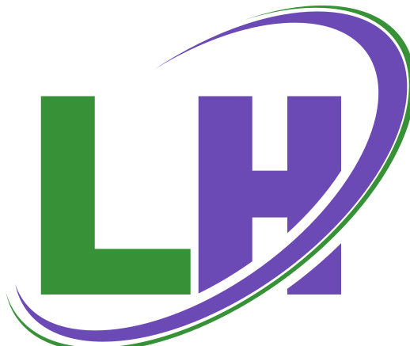

<div align="center">



# Travel Booking (React + Vite)

Discover and book unique stays. A modern, responsive React application built with Vite, Tailwind CSS 4, React Router v7, and Headless UI.

</div>

## ✨ Features

- Responsive layout with mobile-first navigation & slide-out menu
- Hero, feature highlights, and promotional CTA sections
- Dynamic property listings (exclusive properties showcase)
- Stays page (all properties) – easily extendable with filtering/search (roadmap)
- Blogs page with category tags, author metadata & teaser cards
- About & Contact pages (static content placeholders)
- Reusable data layer via `assets.js` for properties & blog posts
- Centralized image asset management
- Clean component structure and Tailwind utility styling
- Modern tooling: Vite HMR, ESLint 9, React 19, Tailwind CSS 4 + `@tailwindcss/vite`

## 🧱 Tech Stack

| Layer | Tech |
|-------|------|
| Framework | React 19 |
| Build Tool | Vite 7 |
| Styling | Tailwind CSS 4 (via `@tailwindcss/vite`) |
| UI Utilities | Headless UI, Lucide Icons |
| Routing | React Router DOM v7 |
| Linting | ESLint 9 (flat config) |

## 🚀 Getting Started

### Prerequisites
- Node.js 18+ (LTS recommended)
- npm (comes with Node) or pnpm / yarn (adjust commands accordingly)

### Install
```powershell
# Clone (replace with your repository URL)
git clone https://github.com/your-user/travel-booking.git
cd travel-booking

# Install dependencies
npm install
```

### Run Development Server
```powershell
npm run dev
```
Open the printed local URL (typically http://localhost:5173).

### Production Build & Preview
```powershell
npm run build
npm run preview
```

## 🧩 Key Scripts
| Command | Purpose |
|---------|---------|
| `npm run dev` | Start Vite dev server (HMR) |
| `npm run build` | Production build (optimized) |
| `npm run preview` | Preview built app locally |
| `npm run lint` | Run ESLint over source |


Made with React + Vite ⚡

> Replace placeholder sections (license, repo URL, roadmap) as your project evolves.
